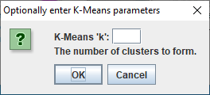

# Cluster My Data (v0.0.2)
*version release date:04/01/21*

This is an ImageJ/Fiji plugin for data clustering. It uses an awesome java library 'clust4j' [(github repo)](https://github.com/tgsmith61591/clust4j) made by Taylor G Smith (and distributed under an Apache licence).

'Cluster My Data', takes data from the results table generated by the default scatter plot (the one generated with the 'List' button on the bottom frame of the plot) and applies a specified clustering algorithm to it, before generating a new plot which is coloured by cluster.
For example, from this already ground-truth clustered UMAP plot of mnist numbers 0 to 3:

<br />
The table entitled 'Plot Values' can be generated using the ImageJ plot 'List' command.<br />


With this table open, the 'Cluster My Data' plugin can be called. If the data is already clustered, as above, then the plugin will first concatenate data-groups. In case it isn't obvious, the plugin will work on any table entitled 'Plot Values', so long as the contained data is 2-dimensional (e.g. X, Y values). **Clustering is especially useful for multi-dimensional data that has been reduced to 2-dimensions (for example with PCA, t-SNE, or UMAP)**. NOTE: This plugin works well with my [Dimensionality Reduction](https://github.com/antinos/Dimensionality_Reduction-ImageJ) ImageJ plugin.

'Cluster My Data' can be called from a macro with:

```javascript
//without specifying a clustering algorithm, the plotted data will be un-clustered
run("Cluster My Data");
```
<br />which in the above case, will actually remove the pre-existing clusters:

<br />

However, with:

```javascript
//HDBSCAN assigning optional parameters 'min cluster size' and 'min points'
run("Cluster My Data", "hdbscan min_clus_size=40 min_points=20");
```

the following plot is generated, from which all clustered datapoints can be retrieved:

<br />

**NOTE: data can be pre-clustered or un-clustered for the plugin to work**

The plugin can also be called from drop-down shortcuts in the gui via *Plugins>Cluster My Data>...*
And from which a dialogue box will appear asking for optional clustering parameters. For instance, the following is presented when 'K-Means' is selected from the drop-down:



Currently, I have included the following clustering algorithms, and their optional parameters, in the plugin:
* K-Means ``run("Cluster My Data", "k_means=4"); ``
* K-Medoids ``run("Cluster My Data", "k_medoids=4"); ``
* DBSCAN ``run("Cluster My Data", "dbscan epsilon=0.4 min_points=10"); ``
* HDBSCAN ``run("Cluster My Data", "hdbscan min_clus_size=40 min_points=20"); ``
* Affinity Propagation ``run("Cluster My Data", "affinity_prop damping_factor=0.5 iterations_break=15 max_iterations=200"); ``<br />(above showing some arbitrary optional parameter assignments)

But Taylor's library additionally offers these:
* hierarchical agglomerative
* mean shift
* Nearest Neighbours
* Radius Neighbours
* Nearest Centroid

All of which can be easily added to the plugin with a little more time.

My plugin can also output to .csv as an option or colour-label the datapoints with a user supplied .csv file of ordered labels. However, I didn't spend too much time optimising these last two functions as they are secondary to the main function of the plugin.

As this is still in development, I haven't requested an update site for the plugin, so feel free to access it via this google-drive link:
[Google Drive link](https://drive.google.com/drive/folders/1iK5MMH9gyhd0R-cIeFQQne0bjKhQMYvO?usp=sharing)
<br />In which folder I have also added two test scatter plots to play with.
**To install, just copy the 'Cluster_My_Data-0.0.2.jar' to the plugins folder.**

FINAL NOTE: I noticed that HDBSCAN will sometimes fail. I think this happens with smaller datasets, and may be to do with which sub-implementation is chosen by the library. Taylor does state that his library may not be 100% ready for production environments and the problem wasn't frequent enough for me to want to remove HDBSCAN from the plugin.
